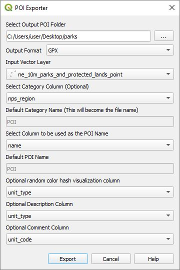
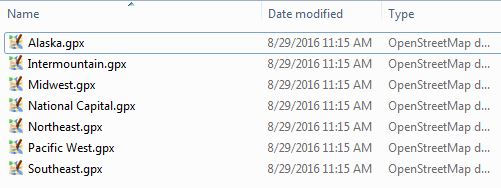

# QGIS GPS Point of Interest Exporter

The ***POI Exporter*** plugin was designed to create points of interest used by **Garmin GPS** devices, but may work for other devices as well. Please let me know if it works for your brand. If there is a slight change that is needed to support your GPS device, let me know and I may be able to implement it. The only reason it has not been tested on other devices is because I only have Garmin devices. 

If you download the plugin from github, rename the folder to poiexport and put it in the QGIS plugins directory. When you launch QGIS and enable the plugin, it will be displayed in QGIS under the menu ***Vector->GIS->POI Exporter***. It can also be launch from the toolbar by clicking on this icon .

## POI Exporter Dialog
This is the dialog box that will be seen when ***POI Exporter*** is launched.

In this example we are using the [Natural Earth Parks and Protected Lands Data](http://www.naturalearthdata.com/downloads/10m-cultural-vectors/parks-and-protected-lands/) data set. The following show the different parameters used by this example.

* **Select Output POI Folder** - This is the folder that the POI files are saved in and is also what the [Garmin POI Loader](http://www.garmin.com/us/maps/poiloader) uses to load the POIs onto their devices.
* **Output Format** - Currently ***GPX*** and ***Garmin CSV*** formats are supported.
    * **GPX** - This is a universal format that should work with a number of devices. You can also use this format to import points into [Garmin BaseCamp](http://www.garmin.com/en-US/shop/downloads/basecamp).
    * **Garmin CSV** - This creates a POI CSV file where each line is formatted as:

            Longitude,Latitude,"Name"[,"Description"]
  
        **Name** and **Description** use quoted text strings where each string has double quotes at the beginning and end, and internal double quotes are duplicated. By quoting the strings, commas, new lines, and carriage returns can be used. This shows an example from the Natural Earth data set.
   
            -74.1793513663,40.9151065125,"Paterson Great Falls NHP","National Historical Park"  
            -74.2397354809,40.7858747417,"Thomas Edison NHP","National Historical Park"  
            -75.4446508454,40.0989444031,"Valley Forge NHP","National Historical Park"

* **Input Vector Layer** - All the point vector layers in the QGIS project will be listed here.

* **Select Category Column (Optional)** - Category names become the POI file names. When a column is used as the category name, the POIs are organized into multiple files based on the names specified in this column. If **[Use Default Category]** is used, then the file name will become the string from **Default Category Name**.

* **Default Category Name (This will become the file name)** - When **Select Category Column** is set to **[Use Default Category]**, then the file name will become the string from this text field.

* **Select Column to be use as the POI Name** - If there is a column that represents the name of the POI, then select it here; otherwise, every POI will get the **Default POI Name**. This will be the **Title** or **Name** that is displayed next to the POI marker on the map.

* **Default POI Name** - This specifies a default POI name if a POI Name column is not specified.

* **Optional Description Column** - This is optional and some devices may not use it, but it is supported by **Garmin** devices.

By clicking on the ***Export*** button, one or more **GPX** or **CSV** files will be created. This shows the GPX files created with using the Parks Natural Earth data set and specifying ***nps_region*** as the category column. 

